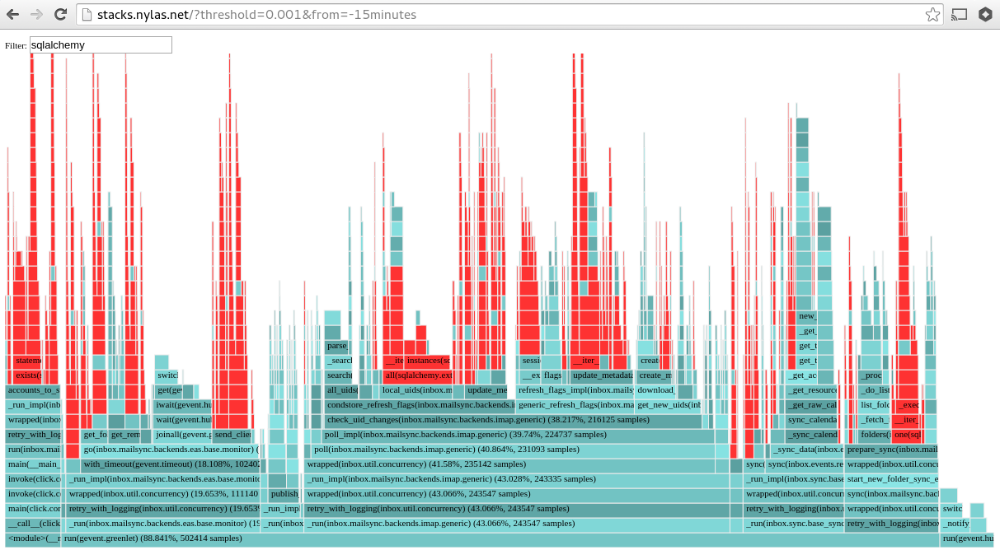

# 生产环境对python调优 -- 我们是如何通过python profiling将cpu用量减少80%的

最近我们通过profiling降低了80%的cpu用量。其中的一个关键就是使用了轻量级的profiling策略从而可以在生产环境使用。这篇文章中使用的仪表可视化方法，一些妥协，还有一些工具，你可以用来优化你的项目。

## 背景

Nylas 是一个通过api为开发者提供集成email、通讯录、日历功能的平台. 他的核心是一个我们称作Sync Engine的技术。它是一个非常大的python项目（～30K LOC）用来同步iMAP、SMTP、ActiveSync等协议。代码已经在github上[开源](https://github.com/nylas/sync-engine)了，而且有一个成熟的社区。

我们运行它，将它作为一个基础设施，为全世界的开发和公司提供服务。他们的产品依赖于我们的正常运行时间和响应时间，所以系统的性能对于我们来说非常重要。

## 如果你能测量它，那么就能够管理它

优化首先是需要测量和仪表化，方法有很多。但是能够在小规模测试环境中benchmark和在大规模实时环境都能正常工作是很重要的一点。

举个例子，一个email加入Nylas平台后，快速的同步消息是很关键的一点。所以我们需要了解在开始同步的几秒钟内，不同的同步策略和优化对其的影响。

通过设置一些本地的测试，增加一些自定义的指令，可以构造出函数的[调用图](https://github.com/nylas/nylas-perftools/blob/master/py2devtools.py)。这个是简单使用`sys.setprofile()`来截取函数的调用。为了更好的看到具体发生了什么，我们可以将调用图导出为json格式，然后将其导入到Chrome浏览器自带的开发者工具中，这个让我们精确的分析程序执行的时间线。


## 让它变成实时的

这个策略对于应用的某个部分的细节做benchmarking可以很好的工作，但是对于一个大的系统的总体的性能分析并不是很适用。函数调用的截取会明显的降低性能，而且会产生大量的数据，所以我们不能直接将其在生产环境中profiling。

然后，在人工的压测环境下，很难精确的重现生产环境的“卡慢”。Sync Engine的工作负载是异构的：我们同步账号有大有小，而且有着不同的活跃度，而且根据不同的服务提供商有着不同的策略。所以测试并不能反应现实世界的负载，最终会导致一个并不是那么有效的优化。

为了解决这个问题，我们添加了一个非常轻量级的探针，所以能够持续的在生产集群中运行，然后设计一个系统收集这些结果数据，并且将数据转为我们需要的格式以及可控的大小。

这个策略的核心其实就是一个简单的统计采样，定期的收集代码的运行时的调用栈，然后记录他在干啥，这个算法会丢失一些精度，而且是非确定性的，但是开销小且可控（仅仅是选择采样的间隔）。粗糙的监控粒度就行了，因为我们只需要检测在一个大的范围内的“卡顿”现象。

许多库实现了这些功能，但是在python里面我们可以用20行代码写一个对调用栈进行采样的程序。如下：

```python

import collections
import signal

class Sampler(object):
   def __init__(self, interval=0.001):
        self.stack_counts = collections.defaultdict(int)
        self.interval = 0.001

    def _sample(self, signum, frame):
       stack = []
        while frame is not None:
            formatted_frame = '{}({})'.format(frame.f_code.co_name,
                                              frame.f_globals.get('__name__'))
            stack.append(formatted_frame)
            frame = frame.f_back

        formatted_stack = ';'.join(reversed(stack))
        self.stack_counts[formatted_stack] += 1
        signal.setitimer(signal.ITIMER_VIRTUAL, self.interval, 0)

    def start(self):
        signal.signal(signal.VTALRM, self._sample)
        signal.setitimer(signal.ITIMER_VIRTUAL, self.interval, 0)

```

调用 `Sampler.start()` 会在每隔 `interval` 秒这个时间间隔后，发送一个Unix `ITIMER_VIRTUAL` 信号。这一步很关键，他相当于配置了一个定时的闹钟，重复调用 `_sample` 这个方法。

当信号被触发，这个函数将会保存应用程序的调用栈，然后追踪我们对相同的栈采样的次数。越频繁的采样次数就对应了代码运行路径花费了更多时间。

保存这些调用栈统计信息的内存开销是很合理的，因为程序的frame 的数量是有限的。如果有需要，我们也可以限制内存的用量，比如可以定期的删减掉调用不是太频繁的frame，在我们的系统中，真实的CPU开销可以忽略：


现在我们会在应用中增加监控，通过HTTP的接口（[代码](https://github.com/nylas/nylas-perftools/blob/master/stacksampler.py#L75)）每个工作进程会暴露它采样的信息。这使得我们可以在生产环境生成[火焰图](https://github.com/brendangregg/FlameGraph)，清洗的展示出工作进程的时间分布。

```
curl $host:$port | flamegraph.pl > profile.svg
```


这个可视化技术可以快速的定位CPU时间花费在了哪些进程。举个例子，有接近15%的运行时时间花费到了如图高量展示的`get()`方法上，所以可发现执行数据库的加载通常是不必要的。这个现象通常在本地测试中是很难发现的，但是现在就很容易被识别和修复。

然而，单个工作进程的负载并不足以展示全部工作进程和实例的总的工作负载。我们需要多个进程之间产生的调用栈数据。同样我们需要保存历史数据，因为采集器只会收集当前的进程的生命周期。

为了做到这些，我们运行了一个采集的agent定期的轮询所有的Sync Engine进程，然后将采集的数据聚合后，存储在本地。因为我们以http的形式提供数据，所以并不需要对生产环境下实例的某个文件tail和rotate。

最后，一个轻量级的web应用就可可视化这一切。现在来回答“我们的CPU时间都花费到哪个地方了？”这个问题的话，仅仅只需访问一个内部的URL：



因为我们可以对任意时间段做Profiling，所以很容易的追溯导致性能问题的原因和何时产生的。

代码已经在Github上[开源](https://github.com/nylas/nylas-perftools)了，你可以自己尝试它。

## 结果

部署了这一套采样分析工具后，很容易就可以识别系统慢的部分，然后采用一堆优化的方法来加速它。CPU的负载减少了80%。下面的图中展示了一系列的补丁后，优化的效果。


能从多方面够测量和自省我们系统是保持他们稳定和高性能的关键。本文中的简单的工具只是Nylas庞大的监控基础架构的一小部分。希望能够在今后的博文中介绍更多。


原文链接：
[Profiling Python in Production](https://www.nylas.com/blog/performance)
